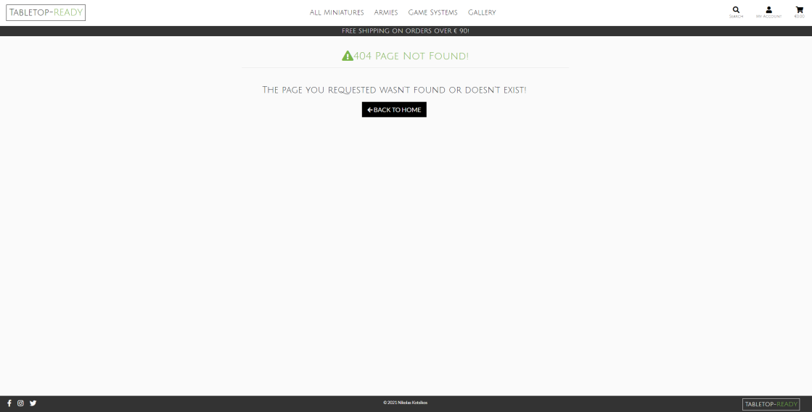

## <ins>Testing</ins>

**

 Testing Documentation
**
  - [Testing user stories](#testing-user-stories)
  - [Manual function testing](#manual-function-testing)
  - [Validator checks](#validator-checks)
  - [Audits](#audits)
  - [Responsive Design](#responsive-design)
  - [Additional Testing](#additional-testing)
  - [Bugs](#bugs)

---

### **Testing user stories**

#### <ins>Viewing and Navigation</ins>

**1. Discover Tabletop-Ready’s purpose and goals**

I created an 'about' and 'meet the coaches' page so any site visitor can learn about the brand and the coaches behind it. Both pages are easily accessible via the main nav menu.

**2. View a list of miniatures**

I created a 'miniatures' page including a list of all miniatures, displaying miniature image, name, colour, price, and rating, with the option to select an individual card for more details. This page is accessible via the main nav menu, links featured on the callout carousel, and through a card link on the homepage.

**3. View a list of armys**

I created a 'armys' page including a list of all armys, displaying army image, name, price, and rating, with the option to select an individual card for more details. This page is accessible via the main nav menu, links featured on the callout carousel, and through a card link on the homepage.

**4. View a specific category of miniatures or armys**

I added a filter option to both the miniatures and armys page giving users the ability to quickly find what they are searching for. 

`(More specific details on this in user story 17)`

**5. View individual miniature details**

Each miniature detail page displays the miniature's image, name, colour, price, rating, description, and available sizes. There is also a quantity selector, the ability to add a miniature to their bag and the option to redirect back to the miniatures page.

**6. View individual army details**

Each army detail page displays the army's image, name, price, rating, description, what's included, and reviews. There is also a quantity selector, the ability to add a army to their bag and the option to redirect back to the armys page.

**7. Easily access contact details**

I have included a contact form on the home page which is easily navigated to via the main nav menu. If a user is logged in, the full name and email field are pre-populated.
- User receives a toast success response to confirm that the message was sent successfully. The form is also reset on a message success.

**8. See reviews and ratings on miniatures and armys**

Testimonials are visible on the homepage and reviews are available on the armys detail page. Users are also able to see the rating for each individual miniature/army under each item on the miniatures/armys page and additionally on the miniature/army details page.

> **Note:** As this is a startup and business hasn't yet begun, the testimonials, reviews, and ratings are currently only mockups. As mentioned in my future plans, the ability for users to add reviews will be implemented.

**9. Browse associated blogs, articles, and recent new stories**

I created a blog app that can only be viewed by site members. The page is available through the nav menu and there is also the option for the user to direct to the latest blogs via the homepage. When a user is not logged in and they click on the blog they will be directed to the 'Login' page with an info toast response. If a user is a member and logged in they will be directed to the blog page where they can view blogs posted by the admin user. There is a toggle button to display references, and users have the ability to add and delete their own comments on blog posts.

- The delete function has a confirmation modal which gives an extra step for users to consider their action.
- I also added the option for the site owner to delete a comment manually, allowing anything inappropriate to be removed quickly.

**10. Access a member forum**

I created a forum app that can only be accessed by site members. When a user is not logged in and they click on the forum they will be directed to the 'Login' page with an info toast response. If a user is a member and logged in they will be directed to the forum page where they will have the option to view threads by other users and add/edit their own. They also have the capability of replying to any thread, with their logged in username and date/time automatically saved. There is a trash icon visible on the users own replies giving them the option to delete if they wish.

- The delete function has a confirmation modal which gives an extra step for users to consider their action.
- I also added the option for the site owner to delete a reply manually, allowing anything inappropriate to be removed quickly.

#### <ins>Registration and user accounts</ins>

**10. Easily register for an account**

A fully functioning 'Register' page where a user can enter their details to create an account. The user can access this page by clicking on the recognisable user icon and selecting 'Register'.

**11. Receive an email confirmation after registering**

After registering the user is directed to a registration success page where they are informed that they will receive an email to validate their email address and complete registration.

**12. Easily login or logout**

When a user is registered they have the ability to easily log into their account. The user can click on the profile icon, then select login and enter their details to sign into their account. Once logged in the user will be able to log out via the profile icon.

I also decided to add social logins to allow my user to log in more quickly. The user can choose their preferred platform (Facebook, Google, or Twitter) and follow the authorisation for the specified site. (Facebook screenshots included below).

**13. Easily update my personal details**

Each registered user has their own profile page where they can store their personal details including name, email, and delivery details. This information can be easily updated by filling in any field and then clicking 'update details'.

**14. Easily recover my password in case I forget it**

If a user forgets their password they have the option to click the 'Forgot Password?' link. This will direct them to another page which will inform the user that an email has been sent to them to recover their password. The email contains a link that redirects the user to the change password page where they can enter a new password for their account. After submitting a new password the user is redirected to the login page and can log in using their new password.

**15. Have a personalised user profile**

The profile page is specific to each user with a personalised username greeting, the option to save their own entered details, and a log of their order history.
- I added the 'dictsortreversed' filter with key 'date' to ensure orders are listed in descending order with most recent showing first.
    - There is a slight issue with using Django date filter to sort the orders as this doesn't take into account the time the purchase was made, and therefore orders made on the same day are not sorted accurately. I will continue to find an alternative solution for this however this was not a priority as it is unlikely a customer will make multiple purchases on the same day.

**16. Enable my details to be prefilled**

If the user has filled in their profile information, these details will be prefilled at checkout. The user also has the option to tick the save details options on checkout which will automatically save details to their profile page.

#### <ins>Sorting and Searching</ins>

**17. Sort and filter the list of available miniatures and armys**

I have added a sort and filter option to the miniatures and armys page to allow a user to easily find what they are looking for. There is a 'Clear all' option at the top of the filter dropdown which allows a user to remove the filter and display all items. 
- I also decided to add this function to the blog page as I think it will be useful to the user as more blogs get posted over time. 

The pages also feature a count functionality showing the user how many items are being displayed on the page. For example, if the user filtered the miniatures page by accessories they would see all the accessories and the number of miniatures found. If no miniatures are found the user would be displayed with the message "Sorry no search results found".

**18. Search the site by keywords**

A search bar features in the main site header and allows users to search by keywords to find specific items. On larger screens the search bar is visible and on smaller devices, the search bar is collapsed from the search icon.
- The filtered queries include miniature name, miniature description, army name, army description, and blog post title.
- 'icontains' has been used making the search case-insensitive. Although some results aren't always seen as logical I wanted to continue to use icontains over iexact as it creates a more flexible search. As the site develops I will look into other ways of creating a more robust search.

**19. Easily see what I’ve searched for and the number of results**

The miniatures, armys and blog page all feature a results count to show the user how many items are available to them. (View user story 17 and 18 for screenshots)

#### <ins>Purchasing and checkout</ins>

**20. Easily select the size and quantity of a miniature/army when purchasing it**

The miniature detail page allows a user to select a specific size, if the miniature is sized, and the quantity of a miniature.
The army detail page allows a user to select a quantity of a army to add to their bag.

**21. View items in my bag to be purchased**

The bag view allows the user to view all the miniatures and armys they have added to their bag before continuing to the checkout.

**22. Adjust the quantity of individual items in my bag**

The user has the ability to adjust the number of miniatures and armys in their bag before continuing to checkout.

**23. Easily enter my payment information and feel my personal and payment information is safe and secure**

The checkout page features a payment form allowing the user to easily enter their card details for a quick checkout.

**25. View an order confirmation after checkout**

Once the user has made a purchase they are directed to a checkout success page where they can see a summary of their order and check for any mistakes.

**26. Receive an email confirmation after checking out**

Once the user has made a purchase they are sent an email with a summary of their order to keep for their own records.

#### <ins>Admin and Store Management</ins>

**27. Add a miniature/army**

When logged in as the admin user, the user has the option of 'miniature management' and 'army management' when clicking on the profile icon on the main site header. After clicking the link they are directed to a page displayed with a form to enter all the information needed to add a new miniature/army. Once the user has finished adding the miniature/army details they can click 'Add miniature'/'Add army' and will be redirected to the miniature/army detail page for the new item.

**28. Edit/Update a miniature/army**

When logged in as admin user, the user has an edit button displayed under each miniature/army card on the miniatures/armys page, as well as on each miniature/army detail page. After clicking 'Edit' from either view the user is directed to the edit miniature/army page which is a pre-filled out form allowing the fields to be amended manually from the site. Once the user has finished with their edits they can click 'Update Information' and the new miniature/army information will be saved, and they will be redirected back to the miniature/army detail page.

**29. Delete a miniature/army**

When logged in as admin user, the user has a delete button displayed next to the edit button. After clicking 'Delete' from either view, the miniature/army is removed from the site but will still be available in the admin.
- The delete functionality was updated so the item was only visually removed from the site instead of permanently deleted, to fix a bug I came across (more details on this included in the 'Bugs' section). This also allows the site owner to keep all their items stored on the database if needed in the future. 

**30. Add a blog**

When logged into the admin, the admin user can add a new blog to the site. 
- I didn't think it was necessary to add a manual function for adding a blog as these will be posted less frequently and have a smaller chance of needing modifications after being posted.

**31. Links to Tabletop-Ready social media platforms**

Social media platform links are featured in the page footer below the copyright statement, and if clicked open social site on a new tab.
- At present no social accounts exist for Tabletop-Ready so all links direct the user to the homepage of the external site.
   

## [&#8679;](#testing)
---

### **Manual function testing**

To ensure my site was working correctly I carried out manual function testing on all my apps;

#### General

- [x] Font styling changes as expected when hovering over my button elements
- [x] Opacity filter works as expected when hovering over icon elements
- [x] Cursor pointer is present when hovering button and link elements 
- [x] User is directed to a custom 404 page if directed to a non-existent domain

    

- [x] The 'Go to Homepage' link on the 404 page directs user as expected

#### Navigation bar

- [x] The user can toggle the menu by clicking on the menu/close icon
- [x] The user can close the menu when open by clicking outside the menu area
- [x] If the user clicks a social icon on the footer the expected page opens on a new tab
- [x] The 'About' link on main dropdown menu directs the user to the 'About' page
- [x] The 'Meet the Coaches' link on main dropdown menu directs the user to the 'Meet the Coaches' page
- [x] The 'miniatures' link on main dropdown menu directs the user to the 'miniatures' page displaying all miniatures
- [x] The 'armys' link on main dropdown menu directs the user to the 'armys' page displaying all armys
- [x] If the user is not logged in, the 'Blog' link on main dropdown menu directs the user to the 'Login' page with info toast message
- [x] If the user is logged in, the 'Blog' link on main dropdown menu directs the user to the 'Blog' page displaying all blog posts
- [x] If the user is not logged in, the 'Forum' link on main dropdown menu directs the user to the 'Login' page with info toast message
- [x] If the user is logged in, the 'Forum' link on main dropdown menu directs the user to the 'Forum' page
- [x] If the user clicks the 'Contact' link they are directed to the contact form on the homepage
- [x] The 'Join now' link is only visible on the main menu when a user is not logged in
- [x] The 'Join now' link directs the user to the 'Register' page
- [x] Clicking the brand logo from any page on the site navigates the user back to the homepage
- [x] Search bar showing the correct format based on device size
- [x] After inputting keywords and hitting enter or the search icon, user is directed to the search page template with appropriate results
- [x] If user enters a keyword with no results the correct message is displayed
- [x] If user submits a search with no keywords they are directed to the search page with no results and receive a warning message
- [x] When not logged in, under the profile icon user has the options of 'Register' and 'Login'
- [x] When logged in, under the profile icon user has the options of 'My Profile' and 'Logout'
- [x] When logged in as admin, under the profile icon user has the added options of 'miniature Management' and 'army Management'
- [x] All links displayed on the profile dropdown menu direct the user to the expected page
- [x] When the bag icon is clicked user is directed to the bag template
- [x] Before adding to bag, user is directed to the correct empty bag template
- [x] After adding to bag, user is directed to the bag template displaying the items they have added

#### Sort and Filter
> **Note:** All the below checks were tested on the miniatures, armys, and blog page

- [x] The sort functionality returns items in the order expected. 
- [x] The filter functionality returns only items matching the chosen criteria
- [x] If user selects 'clear all' the filter is removed and all items are displayed
- [x] If the user filters then sorts, the filtered items are displayed in order as expected 
    - This was a bug which has now been fixed (More details in 'Bugs' section)

#### Authorisation

- [x] On the 'Register' page, if the user clicks 'Sign in' they are redirected to the 'Login' page
- [x] If the user completes the registration form with non-existent user details their registration is successful
- [x] After successful registration the user is navigated to the 'Verification email sent' page and an email is sent to the user with link to confirm
- [x] After user clicks link in email they are redirected to 'Verify your email' page 
- [x] After user clicking 'Confirm' on verify your email' page they receive a success message and are redirected to the login page
- [x] If the user completes the registration form with an already registered username and password they receive an error message
- [x] On the login page, if the user clicks 'Sign up' they are redirected to the 'Register' page
- [x] If the user completes the login form with an already registered username and password they are logged in successfully
- [x] If the user completes the login form with non-existent user details they receive an error message
- [x] If the user selects a social login option they are directed to the correct external platform for authorisation
- [x] If the user clicks 'Forgot password?' they are directed to the forgotten password page as expected
- [x] If the user enters their email and clicks 'Reset my password' they are directed to the password reset page as expected
- [x] If the user enters their email and clicks 'Reset my password' they receive an email with a link to reset their password
- [x] After user clicks the link in their email they are redirected to the 'Change password' page
- [x] After submitting a new password the user is presented with a success message 'Your password is now changed' and they can log in with their new password
- [x] If the user clicks 'Remember me' their username and password is automatically available next time logging in
    - On an iPhone the user can login by touch recognition
    - 'Remember me' is thought to introduce unwanted security issues and therefore may be blocked on some devices
- [x] If a user is logged in, the 'Logout' option is visible in the profile icon menu
- [x] If a user clicks 'Logout' they are directed to the 'Logout' page where they can confirm their action

#### Home
- [x] The callout carousel automatically cycles through a series of callout messages with expected interval time
- [x] The messages on the callout carousel are displayed appropriately dependent on whether a user is logged in or not
- [x] The links featured on the callout carousel direct the user to the expected page
- [x] The miniature and army card links direct the user to the expected page
- [x] If the user is not logged in, the 'Read me' link on latest blogs directs user to the 'Login' page with info toast message
- [x] If the user is logged in, the 'Read me' link on latest blogs directs user to the correct 'Post Detail' page
- [x] The testimonial carousel automatically cycles through a series of testimonials with expected interval time
- [x] The testimonial carousel pauses on hover and pointer is present
- [x] All contact form fields are empty if user is not logged in
- [x] Full name and email fields are pre-populated on contact form if user is logged in and information is available in their profile
- [x] All contact form fields are empty if user is logged in but information is not available in their profile
- [x] If user information entered in contact form is valid, and form submission is successful, an email is sent to the expected Gmail account
- [x] If contact form submission is successful the user receives success toast
- [x] After submission the input fields are cleared
- [x] When input is missing in a required field there is an error response
- [x] When input format is incorrect the field validation errors are present

#### Meet the coaches

- [x] The opaque CSS is working as expected on profile image tabs
    - Opacity filter present when not active 
    - Opacity filter removed on hover or if active 

#### miniatures

- [x] Each miniature card directs the user to the 'miniature Detail' page displaying the correct information
- [x] Clicking the increment and decrement on the quantity selector changes the value as expected
- [x] User can not decrement below 0 or increment above 99
- [x] User can not type in a value out of the range 1-99
- [x] Selecting a value from the size selector dropdown updates the field correctly
- [x] miniature is added to the bag successfully after clicking 'Add to bag'
- [x] If miniature is already in bag, quantity is incremented and miniature is not duplicated

<ins>Admin</ins>

When logged in as Admin user...
- [x] The 'miniature Management' option is available in the Profile menu
- [x] When input is missing in a required field there is an error response
- [x] When input format is incorrect the field validation errors are present
- [x] After successfully adding a new miniature I am redirected to the 'miniature Detail' page with the correct information and success toast
- [x] If no image is added to the form submission, the expected 'no image' png file is present 
- [x] The 'Edit' button is visible on the 'miniatures' page and each 'miniature Detail' page
- [x] Clicking the 'Edit' button directs the user to the 'Edit miniature' page with fields prefilled with current information
- [x] An info toast message is present after clicking the 'Edit' button
- [x] After selecting an image the file name appears as expected
- [x] Selecting 'Remove' and saving changes removes current image as expected
- [x] After submitting the Edit form user is redirected to the 'miniature Detail' page with updated the information and success toast
- [x] The 'Delete' button is visible on the 'miniatures' page and each 'miniature Detail' page
- [x] After clicking the 'Delete' button the miniature is no longer visible on the site
- [x] After clicking the 'Delete' button the miniature is still available in the admin
- [x] A success toast message is present after clicking the 'Confirm' button

#### armys

- [x] Each army card directs the user to the 'army Detail' page displaying the correct information
- [x] Clicking the increment and decrement on the quantity selector changes the value as expected
- [x] User can not decrement below 0 or increment above 99
- [x] User can not type in a value out of the range 1-99
- [x] army is added to the bag successfully after clicking 'Add to bag'
- [x] If army is already in bag, quantity is incremented and army is not duplicated
- [x] The review carousel automatically cycles through a series of callout messages with expected interval time
- [x] The review carousel controls allow the user to scroll back and forth

<ins>Admin</ins>

When logged in as Admin user...
- [x] The 'army Management' option is available in the Profile menu
- [x] When input is missing in a required field there is an error response
- [x] When input format is incorrect the field validation errors are present
- [x] After successfully adding a new army I am redirected to the 'army Detail' page with the correct information and success toast
- [x] If no image is added to the form submission, the expected 'no image' png file is present 
- [x] The 'Edit' button is visible on the 'armys' page and each 'army Detail' page
- [x] Clicking the 'Edit' button directs the user to the 'Edit army' page with fields prefilled with current information
- [x] An info toast message is present after clicking the 'Edit' button 
- [x] After selecting an image the file name appears as expected
- [x] Selecting 'Remove' and saving changes removes current image as expected
- [x] After submitting the Edit form user is redirected to the 'army Detail' page with the updated information and success toast
- [x] The 'Delete' button is visible on the 'armys' page and each 'army Detail' page
- [x] After clicking the 'Delete' button the army is no longer visible on the site
- [x] After clicking the 'Delete' button the army is still available in Django admin

#### Bag

- [x] After adding to bag all details are listed in the bag template as expected. 
    - To ensure the type of item added to the bag was correct I had to add category to my bag session to differentiate the miniatures from armys.
- [x] Clicking 'Shop miniatures' navigates the user back to the 'miniatures' page
- [x] Clicking 'Shop armys' navigates the user back to the 'armys' page
- [x] Clicking 'Secure checkout' navigates the user to the 'Checkout' page as expected
- [x] By using the increment and decrement buttons, and clicking 'Update' I can to amend the quantity of an item in the bag
- [x] I can enter a numeric value into the field to update the quantity
- [x] I am not able to enter a non-numeric value into the fields
- [x] I am not able to update quantity with value outside of range 0-99
    - This was a bug which has now been fixed (More details in 'Bugs' section)
- [x] I can remove the item from the bag by clicking 'Remove'
- [x] I can remove the item from the bag by entering 0 into the quantity field and clicking 'Update'
- [x] If amendments are made in the bag subtotal is updated accordingly
- [x] Toast success message is present when item is adjusted
- [x] Toast success message is present when item is removed
- [x] Clicking arrow at bottom of bag navigates user to top of page

#### Checkout

- [x] The order summary contains the correct details of the items listed in the bag
- [x] If a site visitor the user input fields are all empty 
- [x] If a site member and details have been previously saved in 'My Profile' the checkout fields are already prefilled
- [x] When input is missing in a required field there is an error response
- [x] When input format is incorrect the field validation errors are present
- [x] If user enters details and checks 'Save this delivery information to my profile', the information is saved to their profile after submission
- [x] If user enters details and doesn't check 'Save this delivery information to my profile', the information is not saved to their profile after submission
- [x] After entering details and clicking 'Checkout' the loading page is present
- [x] The user is redirected to the checkout success page after completing order
- [x] The checkout success page contains all the correct personal details for the user and items purchased
- [x] After successful checkout the user receives an email with their order details
- [x] After successful checkout the user receives toast success message
- [x] User can checkout successfully as both a site user (not logged in) and member (logged in)
- [x] The delivery amount is showing as 10% of the subtotal cost
- [x] If the order is over £40 the delivery amount is 0

#### Blog

- [x] The 'Read me' link for each blog directs the user to the post detail page, displaying the correct information
- [x] The user can toggle references making text visible or hidden
- [x] Below the comment field, the signed in user name is showing correctly
- [x] If user enters a comment and clicks submit their comment is added successfully
- [x] If user submits comment successfully, they receive a success toast
- [x] The comment count is calculated correctly
- [x] The posted comment is displayed with the correct DateTime and logged in username
- [x] The comments are listed in the correct order, newest first
- [x] After submitting a comment the input field is cleared
- [x] The trash icon is only visible on comments the logged in user has posted 
- [x] The trash icon is visible if logged in as admin user
- [x] After clicking the trash icon the user is presented with a modal to confirm their action
- [x] After clicking 'Confirm' in the delete modal, the comment is deleted and success toast is presented to user

#### Forum

- [x] Clicking on a 'topic' link directs the user to the thread detail page, displaying the correct information
- [x] The active thread count is calculated correctly
- [x] Below the response field, the signed in user name is showing correctly
- [x] If user enters a reply and clicks submit their reply is added successfully
- [x] If user submits reply successfully, they receive a success toast
- [x] The reply count is calculated correctly
- [x] The posted reply is displayed with the correct DateTime and logged in username
- [x] The replies are listed in the correct order, newest first
- [x] After submitting a reply the input field is cleared
- [x] The trash icon is only visible on replies the logged in user has posted 
- [x] The trash icon is visible if logged in as admin user
- [x] After clicking the trash icon the user is presented with a modal to confirm their action
- [x] After clicking 'Confirm' in the delete modal, the reply is deleted and success toast is presented to user
- [x] The 'Add Thread' button directs the user to the 'Add Thread' page as expected
- [x] After successfully adding a new thread I am redirected to the 'Thread Detail' page with the correct information and toast success message
- [x] When input is missing in a required field there is an error response
- [x] The 'Edit' button is only visible on threads the logged in user has posted
- [x] Clicking the 'Edit' button directs the user to the 'Edit Thread' page with fields prefilled with current Information
- [x] An info toast message is present after clicking the 'Edit' button
- [x] After submitting the Edit form user is redirected to the 'Thread Detail' page with updated the information and success toast

#### Profile

- [x] The welcome message is personalised with the correct username for the logged in user
- [x] The user's order history is listed with previous purchases
- [x] The order history is listed in date descending order with most recent showing first
    - Small issue highlighted in user story 15 above
- [x] After clicking 'View order details' the user is directed to the 'Checkout Success page' showing all details of their order
- [x] On the 'Checkout Success' page, clicking 'Back to profile' navigates the user back to their profile
- [x] If user enters details and clicks 'Update Information' their details are saved to their profile with success toast present
- [x] If user edits their details and clicks 'Update Information' their details are updated on their profile with success toast present
- [x] No fields on user profile are required allowing user to only fill in desired fields
- [x] If user updates their information in their profile this is reflected on the checkout page

## [&#8679;](#testing)
---

### **Validator checks**

The W3C Markup Validator and W3C CSS Validator Services were used to validate every page of the project to ensure there were no syntax errors in the project. The code was entered through direct input. 

- [**HTML Validator**](https://validator.w3.org/)
    - To get the most accurate read of my HTML for validation, I ran my app and extracted my code from the 'View page source'.

    No error or warning messages were received.

- [**CSS Validator**](https://jigsaw.w3.org/css-validator/)

    No error or warning messages were received.

[**JS hint**](https://jshint.com/) was used to check for any errors with my Javascript files. 
JS was also tested by opening the developer console window on Chrome and checking for any errors as I clicked through the site.

- <ins>Warnings received;</ins>

    `let' is available in ES6 (use 'esversion: 6') or Mozilla JS extensions (use moz).`
    
    `'template literal syntax' is only available in ES6 (use 'esversion: 6').`

    Warnings occurred as JShint is using ECMAScript 5.1 specification and my code uses ECMAScript 6 specific syntax. However, all code is valid.

- <ins>Undefined variable;</ins>

    `$`

    `stripe`

    $ (Jquery) and stripe are all defined in base.html.

[**PEP8 online checking tool**](http://pep8online.com/checkresult) was used to inspect my Python code against the style conventions in PEP 8.

[**Flake8**](http://pep8online.com/checkresult) was a python code linting tool also used to help verify pep8, pyflakes and circular complexity. By using the following command I was able to check the problems across all my files without having to open each individual file.

`$ python3 - m flake8`

<ins>PEP8 Issues:</ins>
- I chose to ignore any warnings on migration files since these are automatically generated files so may ignore style rules for efficiency reasons. Also as developers, we usually don't need to touch them so they don't need to be perfectly readable.

- `DJ01 Avoid using null=True on string-based fields`

    As referenced on [stackoverflow](https://stackoverflow.com/questions/59836736/django-why-only-string-based-field-cant-have-null-true), Django allows the use of NULL in string-based fields but it is suggested to avoid it and use '' to represent the empty value. As in most cases, both values (NULL and '') represent the same thing for string-based fields I have chosen to disregard this warning. 

- `E501 line too long`

    This error has been fixed on the majority of my code but some lines in widgets and settings file have been left to avoid breaking up variables.

## [&#8679;](#testing)
---

### **Audits**

[Lighthouse](https://developers.google.com/web/tools/lighthouse) was used to run a series of audits to improve the quality of web pages. Overall performance and errors are highlighted below.

> **Note:** The [performance score](https://web.dev/performance-scoring/) can fluctuate because of changes in underlying conditions.

More specific details

<ins>Performance</ins>

The low-performance review was mainly driven by **First Contentful Paint (FCP)**. I implemented some of the suggested measures to try and improve my score, however, there is no noticeable delay in page loading time. I also checked the load time using the [Page load time](https://chrome.google.com/webstore/detail/page-load-time/fploionmjgeclbkemipmkogoaohcdbig?hl=en) chrome extension which resulted in a respectable 370ms. 

Actions taken:

[`Ensure text remains visible during webfont load`](https://web.dev/font-display/)
- Added 'font-display: swap' to '@font-face' on flaticon.css file
- Added '&display=swap' parameter to the end of Google Fonts URL in base.css

[`Eliminate render-blocking resources`](https://web.dev/render-blocking-resources/)
- Lazy loading - added class 'lazy' to img tags
- Added 'rel="preload" as="style"' attributes to base.css file
- Added 'async' to JS script tags to indicate to the browser that the script file can be executed asynchronously. However, no improvement was made to performance so these were removed.

[`Serve images in next-gen formats`](https://web.dev/uses-webp-images/?utm_source=lighthouse&utm_medium=lr)
- I tried converting my images to JPEG 2000 as suggested, however, the images were not loading due to their limitations of only working on certain browsers. Therefore I have kept my image in a PNG and JPG format.

[`Properly size images`](https://web.dev/uses-responsive-images/?utm_source=lighthouse&utm_medium=lr)
- I used [Resize Pixal](https://www.resizepixel.com/download) to help compress images to ensure they were all under 500KB.

<ins>Accessibility</ins>

`Background and foreground colors do not have a sufficient contrast ratio`

I didn't take any actions as none of my users experienced difficulty reading the text in question. 

<ins>SEO</ins>

`Links do not have descriptive text`

I didn't take any actions as the error was for displaying 'read more' which I believe is a conventional text link for users. This is also very similar to the suggested generic link text 'learn more'.

## [&#8679;](#testing)
---

### **Responsive Design**

- Site created as a mobile-first design.

- Responsive layout achieved through utilising the Bootstrap grid system and applying my own media queries.

- Viewport tag included in the head of HTML files to tell the browser how to respond to different resolutions, particularly mobile ones.

## [&#8679;](#testing)
---

### **Additional Testing**

- Google Chrome was the main site used throughout testing but the application was also trialled on Safari browsers, Firefox, and Microsoft Edge. 
     - Details of any issues found are addressed in bug section

    - Minor faults found in Firefox;
        - Unappealing dropdown select for firefox browser, restyling this has been added to my future plans
        - Warning message in Firefox console;

            

            I haven't yet found the specific reason for this warning, but as all the flaticon icon's are working correctly it does not present a major issue to the application. I will continue to try and find a fix for this error.

- The website was viewed on a variety of devices including HP Laptop, Macbook pro, Ipad, IPhones (Version SE, 6, 7, 8, 11, 12, 12 max pro), Huawei P20 pro.

- Friends and family members were asked to review the site to point out any bugs, user experience issues, and/or suggestions.

  > **Note:** All appropriate suggestions have been added to my future plans.

    Feedback action:
    - Ability to pay using apple pay
    - More search queries so I can search forum topics
    - Add a number count onto the bag icon so I can easily see how many items are in my bag
    - Ability to autofill address by entering postcode 
    - "Can I not access the blog is I'm not registered"
        - Added an info toast message for users not logged in trying to access the blog or forum.
- Project posted on Slack, asking for feedback from fellow students.

- Before submitting my project, I created a [final checklist](readme/files/final-checks.pdf) to ensure I had covered all the important aspects for each app.

## [&#8679;](#testing)
---

### **Bugs**

|     | Bug                                                                           | Action                                                            |
|-----|-------------------------------------------------------------------------------|-------------------------------------------------------------------|
| [] | Main callout image appears blurry on larger devices                   |  The client will provide an alternative image before the site goes commercial |
| [] | Homepage vh including address bar on mobile so cropping bottom of element                   |  I found a solution on [css-tricks](https://css-tricks.com/the-trick-to-viewport-units-on-mobile/) but as this updates the value of --vh, it will trigger a repaint of the page, and the user may experience a jump as a result. As this is only a layout issue on IOS and doesn't hinder UX I decided not to implement this solution. |
| [x] | Item is removed from order history if deleted by admin                   |  This bug was fixed by following [this thread](https://app.slack.com/client/T0L30B202/CGWQJQKC5/thread/C7HS3U3AP-1597961336.047800) found on slack. I added a discontinued field to my models (with default False), updated delete view to change discontinued to true instead of physically deleting item and then referenced to this field in my templates  |
| [x] | Comment reposts on page refresh                   |  Redirect path added to views after post request  |
| [x] | User able to type in any quantity value for item when in shopping bag                  |  Changed 'quantity > 0' to 'quantity in range(1, 99)' and added elif statement for any value over 99 to send an error message to the user. This was acknowledged and helped to solve by a fellow student, @Clint.    |
| [x] | Success toast showing shopping bag when not appropriate                  |  Added a variable called on_page to the miniature and army detail page and used this as a filter within my success toast template. This ensures that the bag view is only displayed on the success message when a user is on these specific pages.     |
| [x] | Plural suffix returned when value is 1                   |  I added 'pluralize' tag to my count filters to ensure text was presented with correct spelling |
| [x] | If filter by category then sort items, filter is removed                   |  Changed sort from dropdown to selector with options, added my own custom styling. Styling involved replacing the custom arrow and adding my own text with absolute positioning. I also replaced the default dropdown arrow by removing the 'dropdown-toggle' class so that the arrow style matched. |
| [x] | Unable to migrate changes, error message received `psycopg2.errors.InvalidTextRepresentation: invalid input syntax for type integer: "test"`               | This happened a couple of times and was solved by resetting my migrations using this [link](https://simpleisbetterthancomplex.com/tutorial/2016/07/26/how-to-reset-migrations.html) recommended by a tutor     |
| [x] | Unable to make migrations even after resetting migrations              | My old database was corrupted so this was solved by resetting my Heroku database as advised by a tutor. I logged into Heroku, selected app, navigated to Resources, selected Heroku Postgres, then in new window clicked Settings then Reset Database.     |
| [x] | After adding my own styling to the sort select, dropdown options were not visible in 'Firefox' or 'Edge' browser              | After trying a few solutions I managed to keep the select value transparent and make the options visible by adding a css black color rule only targeting the option values      |